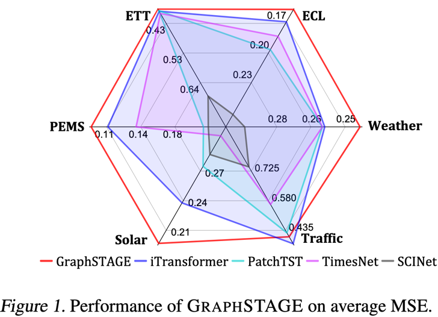
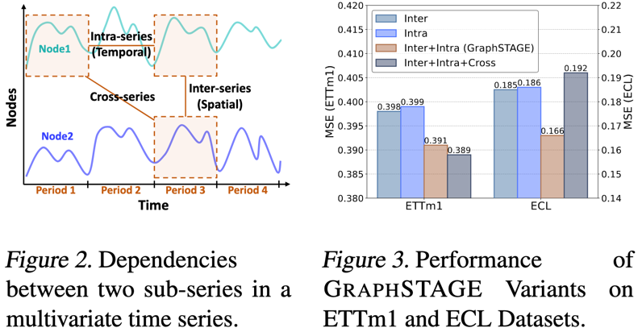
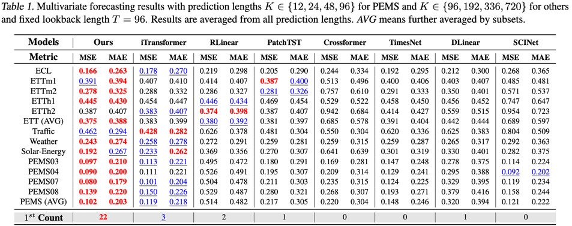
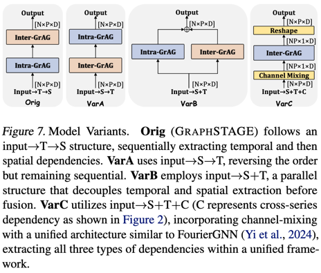
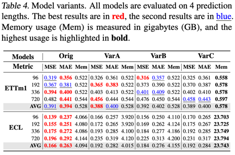
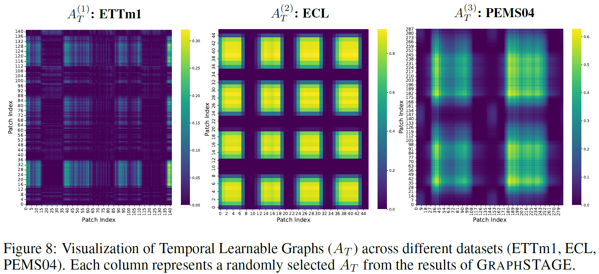
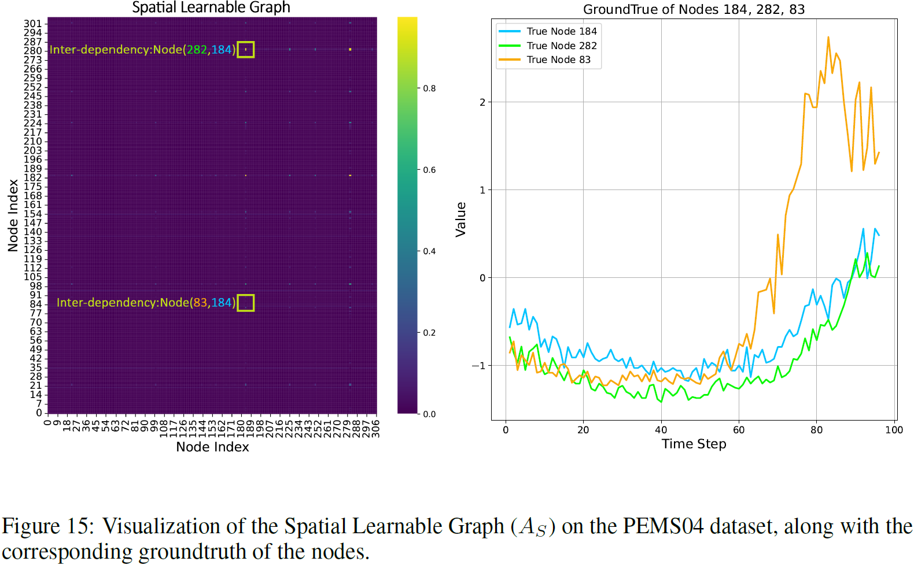

# GraphSTAGE: Channel-Preserving GNNs for Time Series Forecasting
<div style="text-align: center;">
    
</div>

## 📚 Introduction
<div style="text-align: center;">
    
</div>
Recent advancements in multivariate time series forecasting (MTSF) have increasingly focused on the core challenge of learning dependencies within sequences, specifically intra-series (temporal), inter-series (spatial), and cross-series dependencies, as shown in Figure 2. While extracting multiple types of dependencies can theoretically enhance the richness of learned correlations, it also increases computational complexity and may introduce additional noise. **The trade-off between the variety of dependencies extracted and the potential interference has not yet been fully explored.**

<div style="text-align: center;">
    
</div>

Our contributions are threefold:

1. 🤔 We reflect on the extraction of dependencies in current time series models and emphasize that existing methods tend to overlook certain dependencies. Furthermore, we highlight that channel blending and excessive correlation extraction can introduce noise (as demonstrated in Figure 3), and propose a channel-preserving framework to enable more accurate and robust dependency modeling. 
2. 🌟 We propose **GraphSTAGE**, a fully GNN-based method to effectively capture intra-series and inter-series dependencies, respectively, while generating interpretable correlation graphs. Moreover, its decoupled design allows for the independent extraction of specific dependencies as required. 
3. 🏆 Experimentally, despite **GraphSTAGE** is structurally simple, it performs comparably to or surpasses state-of-the-art models across 13 MTSF benchmark datasets (as demonstrated in Figure 1). Notably, **GraphSTAGE ranks top-1 among 8 advanced models in 22 out of 28 comparisons**, with results averaged across various prediction lengths.

## 🧬 Overall Architecture

We propose **GraphSTAGE**, a purely graph neural network (GNN)-based model that decouples the learning of intra-series and inter-series dependencies, as illustrated in Figure 4. GraphSTAGE features a minimal architecture with a specially designed embedding and patching layer, along with the **STAGE** (Spatial-Temporal Aggregation Graph Encoder) blocks. Unlike channel-mixing approaches, GraphSTAGE is a channel-preserving method that maintains the shape of the input data throughout training, thereby avoiding the interference and noise typically caused by channel blending.

<div style="text-align: center;">
    
</div>

## 🚀 Getting Started

### ⚙️ Installation

1. Install Pytorch 3.8+ and then install the necessary dependencies:

```
pip install -r requirements.txt
```

### 📊 Getting Datasets

1. The datasets can be obtained from _Google Drive_. 

**Note: You can download them from the baseline models, such as [iTransformer](https://github.com/thuml/iTransformer), [TimesNet](https://github.com/thuml/TimesNet), and others.**

### 📈 Making Forecasts

1. Train and evaluate the model. We provide all the tasks under the folder ./scripts/. You can reproduce the results as the following examples:

```
# Multivariate forecasting with GraphSTAGE on ECL dataset
bash ./scripts/multivariate_forecasting/ECL/GraphSTAGE.sh


# Multivariate forecasting with GraphSTAGE on Weather dataset
bash ./scripts/multivariate_forecasting/Weather/GraphSTAGE.sh


# Multivariate forecasting with GraphSTAGE on four PEMS sub-datasets
bash ./scripts/multivariate_forecasting/PEMS/GraphSTAGE_03.sh

bash ./scripts/multivariate_forecasting/PEMS/GraphSTAGE_04.sh

bash ./scripts/multivariate_forecasting/PEMS/GraphSTAGE_07.sh

bash ./scripts/multivariate_forecasting/PEMS/GraphSTAGE_08.sh
```

## ⚖️ Main Result of Multivariate Forecasting

Extensive experiments conducted on 13 real-world datasets demonstrate that GraphSTAGE achieves performance comparable to or surpassing state-of-the-art methods, as presented in Table 1.
<div style="text-align: center;">
  
</div>

## 🔬 Variants Comparison

Comparative experiments between our channel-preserving framework and channel-mixing designs show that excessive dependency extraction and channel blending can introduce noise and interference. As illustrated in Figure 7, the proposed GraphSTAGE model is referred to as **Orig**.

<div style="text-align: center;">
  
    &nbsp;&nbsp;&nbsp;&nbsp;
  
</div>

## 🎨 Visualization of Learned Dependencies

As a purely GNN-based model, GraphSTAGE generates learnable graphs in both temporal and spatial dimensions, enabling the visualization of data periodicity and node correlations to enhance model interpretability.

<div style="text-align: center;">
  
</div>

<div style="text-align: center;">
  
</div>
